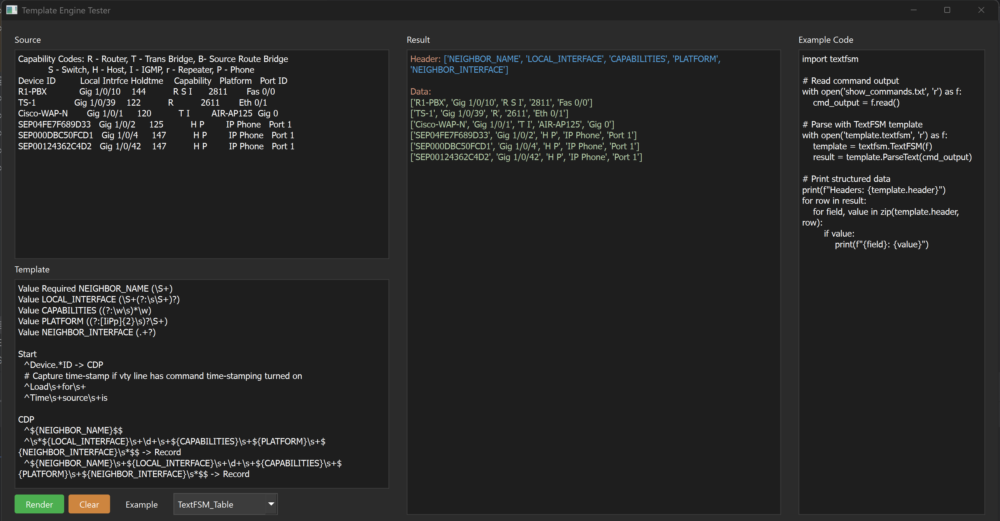

# Templanator

A powerful desktop application for testing and developing network automation templates. Templanator provides a unified interface for working with TextFSM, TTP (Template Text Parser), and Jinja2 templates, making it easier to parse network device outputs and create configuration templates.



## Features

- 🎨 **Multi-Engine Support**: Test TextFSM, TTP, and Jinja2 templates in one application
- 🌙 **Dark Theme Interface**: Easy on the eyes for long template development sessions
- 🎯 **Syntax Highlighting**: Automatic syntax highlighting for template results
- 📚 **Built-in Examples**: Preloaded examples for each template engine including CDP data
- 💾 **Template Database**: 55MB database of network device templates
- 🔥 **Fire Tools**: Quick-launch tools for TextFSM and TTP processing
- 📝 **Code Examples**: View example code for using templates programmatically
- 🚀 **Real-time Testing**: Instantly see results as you develop templates

## Use Cases

- **Network Engineers**: Parse show commands from Cisco, Juniper, Arista, and other network devices
- **DevOps/NetOps**: Develop and test configuration templates before deployment
- **Network Automation**: Prototype data extraction patterns for automation scripts
- **Learning**: Understand how TextFSM and TTP templates work with real examples

## Installation

### Prerequisites

- Python 3.9 or higher
- pip package manager

### Install from GitHub

```bash
# Clone the repository
git clone https://github.com/yourusername/templanator.git
cd templanator

# Create a virtual environment (recommended)
python -m venv .venv

# Activate virtual environment
# On Windows:
.venv\Scripts\activate
# On Linux/Mac:
source .venv/bin/activate

# Install dependencies
pip install -r requirements.txt

# Run the application
python -m templanator.tfsm_ttp_ui
```

### Install from PyPI (coming soon)

```bash
pip install templanator
templanator
```

## Dependencies

- PyQt6 - GUI framework
- textfsm - TextFSM template engine
- ttp - Template Text Parser
- jinja2 - Jinja2 templating engine

## Quick Start

1. **Launch the application**:
   ```bash
   python -m templanator.tfsm_ttp_ui
   ```

2. **Select an example** from the dropdown menu (TextFSM_Table, TTP_Table, etc.)

3. **Click "Example"** to load sample data

4. **Click "Render"** to process the template

5. **View results** in the right panel with syntax highlighting

## Usage Guide

### Template Engines

#### TextFSM
TextFSM is ideal for parsing structured text output from network devices. It uses a state-machine approach with defined values and rules.

**Example Use Case**: Parsing `show ip interface brief` output

#### TTP (Template Text Parser)
TTP uses a simpler, more intuitive syntax with XML-like tags for grouping data. Great for hierarchical data structures.

**Example Use Case**: Parsing CDP neighbor information with nested relationships

#### Jinja2
Jinja2 is used for generating configuration files from templates and variables.

**Example Use Case**: Creating router configurations from standardized templates

### Interface Overview

- **Source Panel** (Left): Paste your raw device output here
- **Template Panel** (Left): Write or paste your template
- **Result Panel** (Right): View parsed output with syntax highlighting
- **Example Code Panel** (Right): See Python code examples for programmatic use
- **Control Buttons**:
  - **Render**: Process the template with your data
  - **Clear**: Clear template and result fields
  - **Example**: Load a built-in example
  - **Dropdown**: Select template engine and format

### Working with Templates

1. **Load an Example**: Start with a built-in example to understand the syntax
2. **Modify the Template**: Edit the template to match your data structure
3. **Test Incrementally**: Use the Render button frequently to test changes
4. **Copy Results**: Select and copy parsed data for use in your scripts

## Template Database

The application includes a comprehensive 55MB database (`tfsm_templates.db`) containing:
- Pre-built TextFSM templates for common network devices
- TTP template examples
- Parsing patterns for various show commands
- Reference data for network automation

## Advanced Features

### Fire Tools
Quick-launch tools for batch processing:
- **TTP Fire**: Process multiple TTP templates
- **TFSM Fire**: Batch TextFSM operations

### Dialogs and Wizards
- **TTP Wizard**: Step-by-step template creation
- **Napalm Tool**: Integration with NAPALM library
- **DB Tool**: Template database management

## Project Structure

```
templanator/
├── tfsm_ttp_ui.py          # Main application UI
├── engines.py              # Template engine implementations
├── cdp_examples.py         # CDP example data
├── code_examples.py        # Python code examples
├── tfsm_fire.py           # TextFSM batch tool
├── ttp_fire.py            # TTP batch tool
├── tfsm_templates.db      # Template database (55MB)
├── dialogs/               # Dialog windows
├── highlighters/          # Syntax highlighters
├── dbinfo/               # Database utilities
├── ntc_templates/        # Network to Code templates
└── ttp_templates/        # TTP template collection
```

## Contributing

Contributions are welcome! Here's how you can help:

1. Fork the repository
2. Create a feature branch (`git checkout -b feature/amazing-feature`)
3. Commit your changes (`git commit -m 'Add amazing feature'`)
4. Push to the branch (`git push origin feature/amazing-feature`)
5. Open a Pull Request

### Areas for Contribution
- Additional template examples
- Support for more template engines
- UI/UX improvements
- Documentation
- Bug fixes
- Performance optimizations

## Roadmap

- [ ] Export results to JSON/CSV
- [ ] Template validation and linting
- [ ] Regex testing mode
- [ ] Template sharing/import feature
- [ ] Plugin system for custom engines
- [ ] Command-line interface
- [ ] Template version control

## Known Issues

- Large template database (55MB) included in repository
- Menu bar disabled in current version (Tools menu in development)

## License

GNU General Public License v3.0 (GPL-3.0)

This project is licensed under GPL-3.0 due to the use of PyQt6. See the [LICENSE](LICENSE) file for details.

## Acknowledgments

- Built with PyQt6
- Uses TextFSM by Google
- Integrates TTP (Template Text Parser)
- Inspired by the network automation community

## Support

- **Issues**: Report bugs or request features via GitHub Issues
- **Discussions**: Join the discussion in GitHub Discussions
- **Documentation**: See the [Wiki](../../wiki) for detailed guides

## Author

[Your Name]

## Links

- **GitHub**: https://github.com/yourusername/templanator
- **PyPI**: https://pypi.org/project/templanator/ (coming soon)
- **Documentation**: [Link to docs]

---

**Made with ❤️ for the Network Automation Community**